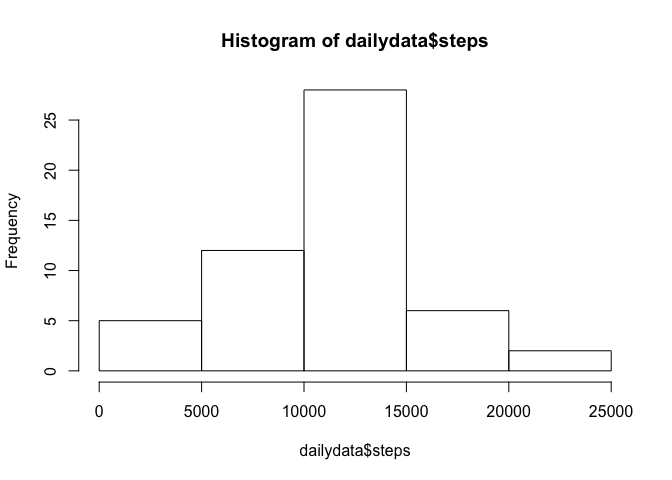
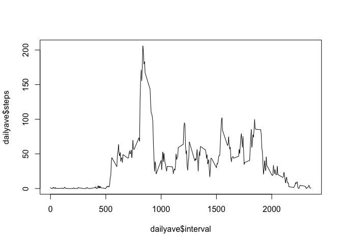
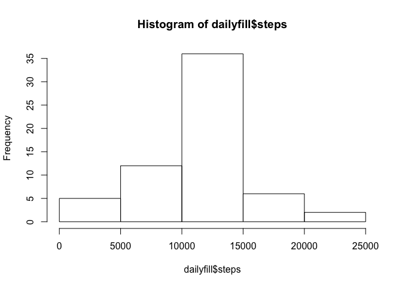

# Reproducible Research: Peer Assessment 1 by raconger

## Loading and preprocessing the data
To load that data, one must read the CSV file:


```r
setwd("~/GitHub/RepData_PeerAssessment1")
data <- read.csv(file="activity.csv",head=TRUE,sep=",")
summary(data)
```

```
##      steps                date          interval     
##  Min.   :  0.00   2012-10-01:  288   Min.   :   0.0  
##  1st Qu.:  0.00   2012-10-02:  288   1st Qu.: 588.8  
##  Median :  0.00   2012-10-03:  288   Median :1177.5  
##  Mean   : 37.38   2012-10-04:  288   Mean   :1177.5  
##  3rd Qu.: 12.00   2012-10-05:  288   3rd Qu.:1766.2  
##  Max.   :806.00   2012-10-06:  288   Max.   :2355.0  
##  NA's   :2304     (Other)   :15840
```

It can be observed that there are many NAs in the imported dataset. This should be cleaned for further analysis. Also, since the data are taken in 5 minute intervals, we must sum up the data into daily 'buckets.'


```r
cleandata <- na.omit(data)
dailydata <- aggregate( . ~ date, data = cleandata, sum)
summary(dailydata)
```

```
##          date        steps          interval     
##  2012-10-02: 1   Min.   :   41   Min.   :339120  
##  2012-10-03: 1   1st Qu.: 8841   1st Qu.:339120  
##  2012-10-04: 1   Median :10765   Median :339120  
##  2012-10-05: 1   Mean   :10766   Mean   :339120  
##  2012-10-06: 1   3rd Qu.:13294   3rd Qu.:339120  
##  2012-10-07: 1   Max.   :21194   Max.   :339120  
##  (Other)   :47
```

## What is mean total number of steps taken per day?

The mean total number of steps taken per day is 1.0766189\times 10^{4} and the median is 1.0766189\times 10^{4}.


```r
summary(dailydata$steps)
```

```
##    Min. 1st Qu.  Median    Mean 3rd Qu.    Max. 
##      41    8841   10760   10770   13290   21190
```

```r
hist(dailydata$steps)
```

 

## What is the average daily activity pattern?

It can be observed that the daily activity peaks in the morning.


```r
dailyave <- aggregate( . ~ interval, data = cleandata, mean)
plot(dailyave$interval, dailyave$steps, type="l")
```

 

With the maximum 5 minute average being 206.1698113 steps at 835 interval.

## Imputing missing values

Utilize a simple replace to fill the mean step value into any NA data entry.


```r
filldata <- data
filldata[is.na(filldata)] <- 37.38
dailyfill <- aggregate( . ~ date, data = filldata, sum)
hist(dailyfill$steps)
```

 

Comparing the initial dataset with the imputed value dataset, the medians and quartiles differ, but the mean remains the same. This aligns with the strategy of pushing the mean to unfilled values. This could give the effect of decreasing the variance/standard deviation and perhaps a more detailed strategy should be used.


```r
summary(dailydata$steps)
```

```
##    Min. 1st Qu.  Median    Mean 3rd Qu.    Max. 
##      41    8841   10760   10770   13290   21190
```

```r
summary(dailyfill$steps)
```

```
##    Min. 1st Qu.  Median    Mean 3rd Qu.    Max. 
##      41    9819   10770   10770   12810   21190
```


